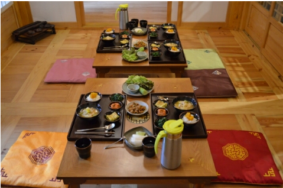

# 2017.05.20 Twelve Meetup Plan

## 05.20 집합 및 저녁식사

### 집합시간
- 2017.05.20(토요일) 5:00 PM

### 식사장소
- 식당명: 충무로 쭈꾸미 불고기
    - 대중교통 이용시 서울 백병원 앞 하차후 도보 이동
- 지도
 

### 대중교통 이용시
 - 서울백병원 앞 하차 
 

### 자가 이용시

## 05.20 2차 장소
- 식당명: 태성골뱅이신사
    - 충무로 쭈꾸미 골뱅이에서 도보 이동
- 지도
 

## 05.20 3차(Optional) 맥주 타임
- 상황에 따라서 할지말지 결정
    - 만약 한다면, 태성골뱅이신사에서 청연재 이동 경로 중 선택 예정
    
- 지도
 

## 05.20 숙소도착 및 티타임, 취침
 - 숙소명: 청연재
 - 주소: 서울 종로구 북촌로6길 13-2
 - [숙소정보 Blog Link](http://blog.naver.com/mummy18/220281337584)

 

## 05.21 조식 후 (한목마을 산책) 귀가
 - 조식 시간: 08시, 09시 두 타임 중 선택
 - 조식 사진

  

- 조식 후 일정
    - 개인사정에 따라 자율적 선택